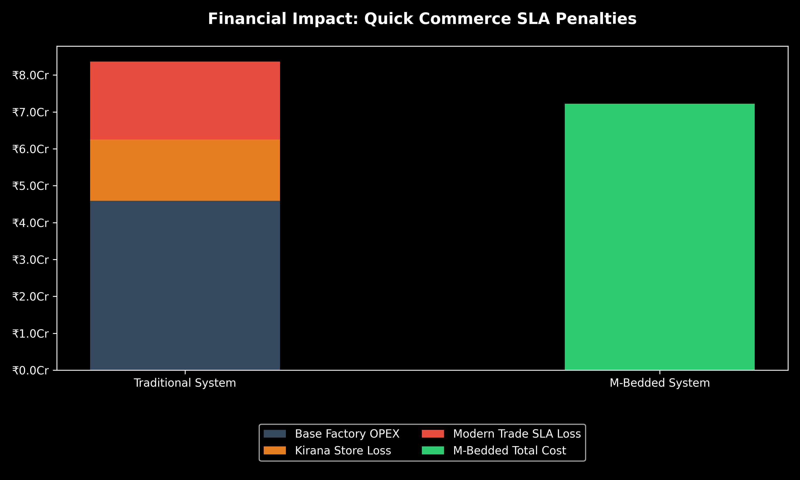
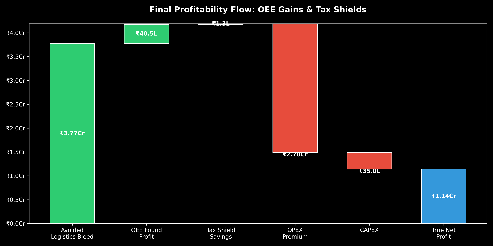
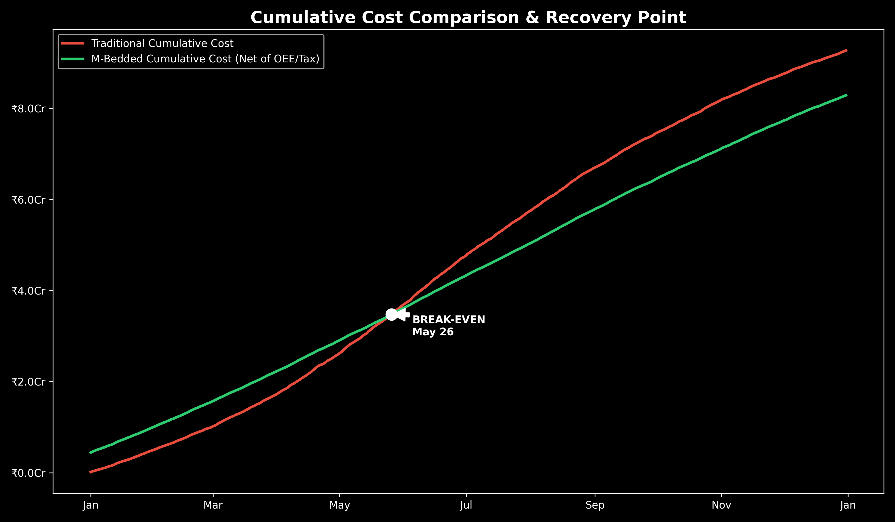

# FMCG Supply Chain Financial Simulation Engine (M-Bedded)

> A Python-based simulation engine that proves a ₹35L hardware upgrade becomes profitable by eliminating FMCG logistics losses and SLA penalties.

---

## 🚨 Problem: The Quick Commerce Logistics Bleed

In the Indian FMCG beverage industry, 200ml cartons with externally attached straws suffer failure rates of up to **12% during summer logistics** due to glue degradation (temperatures reaching 60°C).

While traditional Kirana stores tolerate and manually fix defects, **modern quick commerce platforms (Zepto, Blinkit, Reliance)** enforce strict penalties:

* ₹5 SLA fine per defective unit
* 2.0× pallet rejection multiplier (collateral damage)
* Zero tolerance in automated dark stores

This converts a small physical defect into a **massive financial loss at scale**.

---

## 💡 Solution: M-Bedded Packaging System

M-Bedded is a hardware-based packaging innovation that:

* Eliminates glue-based straw attachment
* Uses a **thermal blister sealing mechanism**
* Achieves **0% logistics shrinkage**
* Removes single-use BOPP plastic

This project simulates a **90 million unit annual production line** to evaluate whether this ₹35 lakh CAPEX upgrade is financially viable.

---

## 📊 Key Results

* Break-even achieved within months (mid-summer)
* Eliminates up to **12% logistics failure losses**
* Recovers ₹35L CAPEX within first operational cycle
* Generates strong net annual profit through:

  * SLA penalty avoidance
  * Factory uptime (OEE) gains
  * Tax shield benefits

---

## 🧠 What This Project Does

This is a **financial simulation engine**, not a static calculator.

It models:

* Seasonal failure rates (temperature-driven)
* Reverse logistics & salvage economics
* Modern trade SLA penalties
* Factory downtime vs uptime (OEE impact)
* CAPEX depreciation and tax savings

It answers:

> **Is upgrading to M-Bedded financially justified for FMCG manufacturers?**

---

## ⚙️ Mathematical & Simulation Engine

### 1. Thermodynamic Seasonality (`data_generator.py`)

* Winter baseline: ~2% failure
* Summer peak: ~12% failure (May–June)
* Continuous probability curve across 365 days

---

### 2. Retail Stream Economics (`financial_engine.py`)

* **Kirana (75%)**

  * 60% units reworked
  * Low penalty recovery

* **Modern Trade (25%)**

  * Strict SLA fines
  * Pallet rejection multiplier
  * High financial impact

---

### 3. Factory Economics (`financial_engine.py`)

* OPEX penalty for new system
* OEE-based revenue recovery (~1.5% uptime gain)
* CAPEX depreciation tax shield (15%)

---

## 📈 Visual Outputs

### 1. SLA Impact Analysis



### 2. Profitability Waterfall



### 3. Break-even Curve



---

## 🏗️ Architecture

**Pipeline:**
Data → Financial Engine → Visualization

**Tech Stack:**

* Python
* Pandas
* NumPy
* Matplotlib

**Structure:**

```
fmcg-supply-chain-simulation/
│
├── src/
│   ├── data_generator.py
│   ├── financial_engine.py
│   └── visualizer.py
│
├── data/
├── images/
├── config.py
├── main.py
└── README.md
```

---

## ▶️ How to Run

```bash
git clone https://github.com/anvesh-27/fmcg-supply-chain-simulation.git
cd fmcg-supply-chain-simulation

pip install pandas matplotlib numpy
python main.py
```

---

## 🚀 Why This Project Matters

This project demonstrates:

* Real-world business problem solving
* Financial modeling & simulation
* Data-driven decision making
* Understanding of supply chain economics
* Ability to connect engineering with business impact

---

## 🔮 Future Improvements

* Interactive dashboard (Streamlit)
* Sensitivity / what-if analysis
* Integration with real FMCG datasets
* Scenario simulation (pricing, scale, exports)

---
